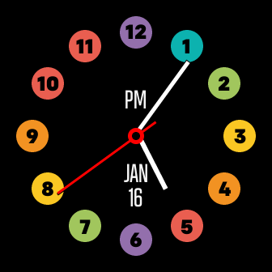

# Color Circles
Color Circles is a simple analog clock face with hour numbers displayed in a variety of color circles. There are several sets of colors for the circles to choose from. The colors displayed can be selected from the clock face settings within the Fitbit phone app. Additionally, AM / PM indicators and current date can optionally be turned on and off within the user settings. 

[Fitbit App Gallery listing](https://gallery.fitbit.com/details/1b21f41e-25b7-493a-9976-42fd3578c726?key=d97e2195-62e6-49fe-b07e-e3c404c25829) 

---
Settings panel for clock-face in Fitbit phone app: 

